# 🚗 Vehicle Demand Analysis & Forecasting Report  
## Malaysia Automotive Market Intelligence (2025)

---

# 1. Introduction

The Malaysian automotive industry is undergoing structural shifts driven by evolving consumer preferences, regional demand concentration, and early-stage electric vehicle (EV) adoption.

This project develops a **full Market Intelligence & Forecasting System** using vehicle registration data from Department Of Statistics Malaysia to:

- Analyze historical demand patterns
- Identify high-performing brands and vehicle segments
- Forecast future market behavior
- Generate AI-driven strategic recommendations

Unlike traditional dashboards, this project integrates:

- Descriptive analytics  
- Predictive modeling  
- Forecast validation  
- Prescriptive business insights  

The outcome is a **decision-support framework** suitable for automotive distributors, manufacturers, and strategy teams.

---

# 2. Data Overview & Preparation

## 2.1 Dataset Description

The dataset contains vehicle registration records across Malaysia, including:

- Registration Month
- Maker (Brand)
- Model
- Vehicle Type (SUV, Sedan, etc.)
- Colour
- EV vs Non-EV
- State (Geographic location)

Each row represents a vehicle registration event.

---

## 2.2 Data Cleaning & Transformation

Data engineering steps performed:

- Date parsing and time-series formatting
- Aggregation into monthly demand counts
- Grouping by maker, model, type, colour, and state
- Preparation for forecasting models

This ensured consistency and time-series compatibility.

---

# 3. Descriptive Market Analysis (What Is Happening?)

---

## 3.1 Overall Market Trend

### Objective:
To understand total vehicle registration trends over time.

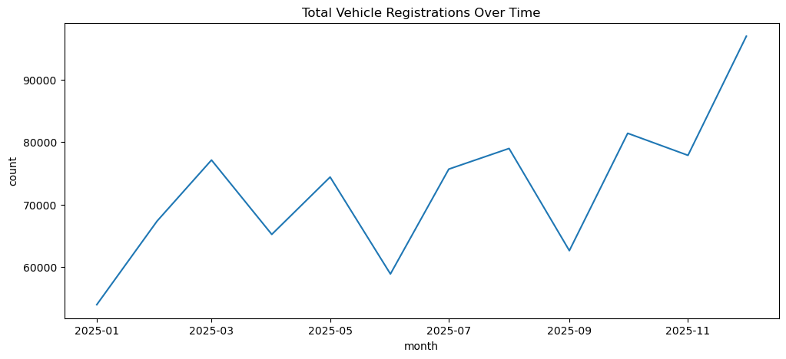

### Key Insights:
- Identify growth or contraction periods
- Detect seasonality patterns
- Establish baseline demand behavior

Business Interpretation:
This defines overall market momentum and macro demand conditions.

---

## 3.2 Brand / Maker Analysis

### Objective:
To determine brand dominance and competitive landscape.

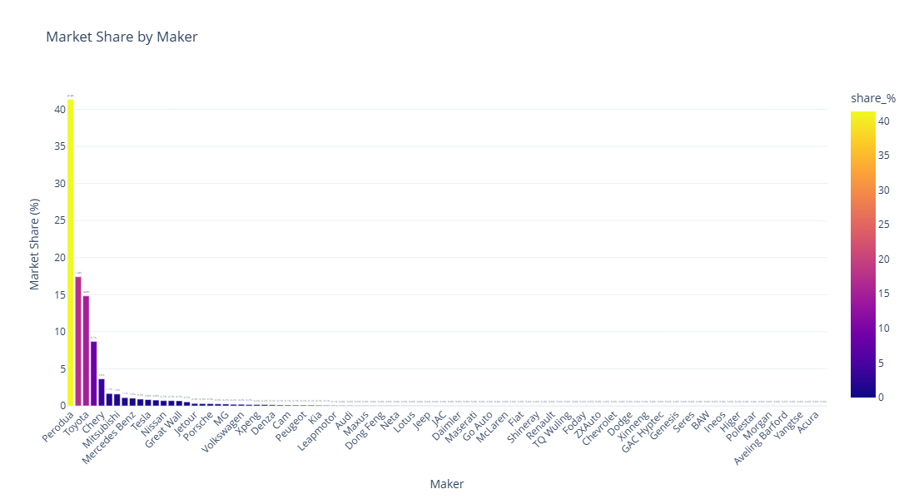
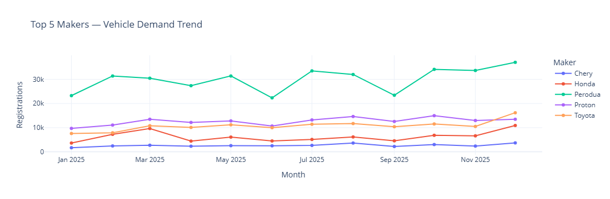 

### Key Insights:
- Market share concentration
- Leading and emerging brands
- Brand performance volatility

Business Interpretation:
Helps distributors prioritize partnerships and production allocation.

---

## 3.3 Model-Level Demand Analysis

### Objective:
To identify high-performing vehicle models.

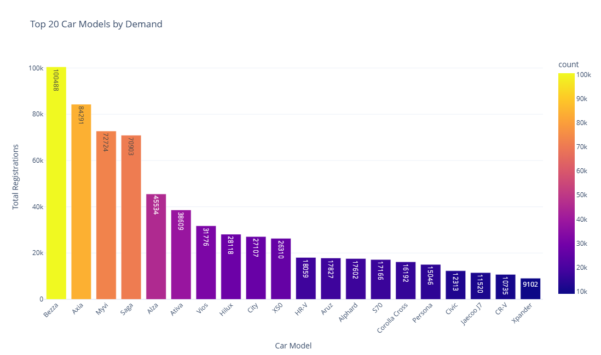

### Key Insights:
- Best-selling models
- Stable vs trending models
- Model lifecycle signals

Business Interpretation:
Supports inventory stocking and marketing focus decisions.

---

## 3.4 Vehicle Type Analysis

### Objective:
To analyze demand by vehicle segment.

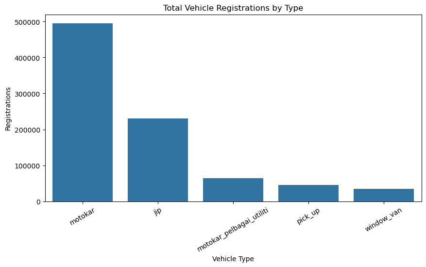
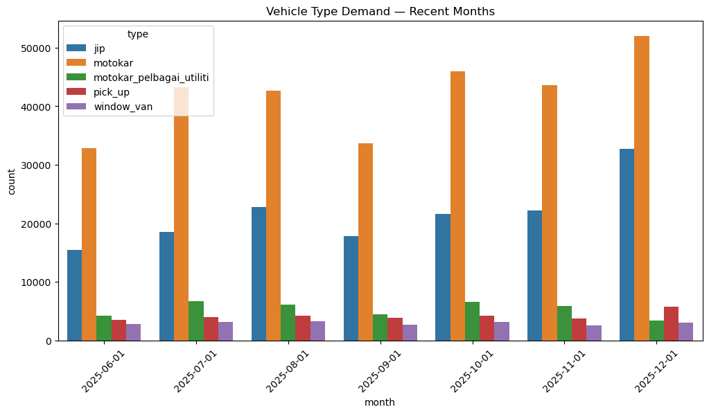  

### Key Insights:
- SUV vs Sedan dominance
- Segment growth patterns
- Consumer preference shift

Business Interpretation:
Guides product development and segment expansion strategy.

---

## 3.5 Electric Vehicle (EV) Analysis

### Objective:
To assess EV adoption trajectory.

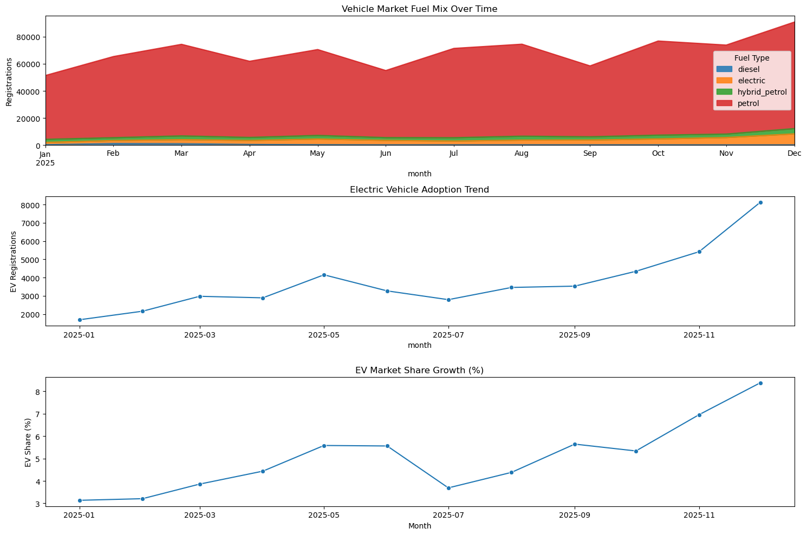

### Key Insights:
- EV growth rate
- Market penetration trend
- Transition stage of electrification

Business Interpretation:
Determines readiness for EV infrastructure investment and strategy.

---

## 3.6 Colour Preference Analysis

### Objective:
To understand consumer aesthetic preferences.

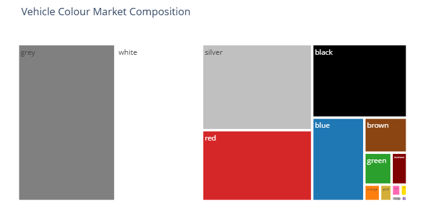  

### Key Insights:
- Dominant colour categories
- Stability of colour preference
- Emerging shifts

Business Interpretation:
Optimizes manufacturing mix and dealership stock composition.

---

## 3.7 Geographic (State-Level) Analysis

### Objective:
To analyze regional demand concentration.

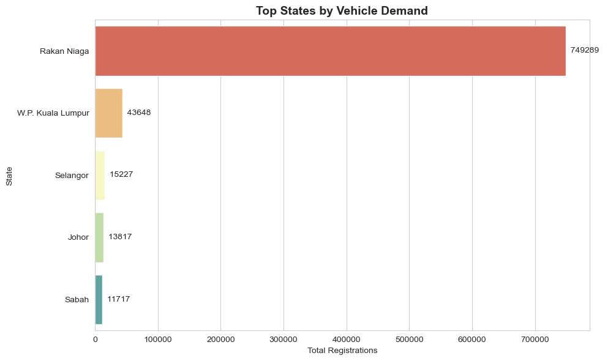 
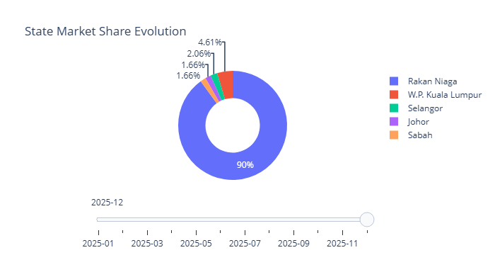

### Key Insights:
- High-demand regions
- Regional disparities
- Potential expansion markets

Business Interpretation:
Supports dealership expansion and regional marketing allocation.

---

# 4. Predictive Analytics (What Will Happen?)

Time-series forecasting models were applied to project future demand.

---

## 4.1 Total Market Forecast

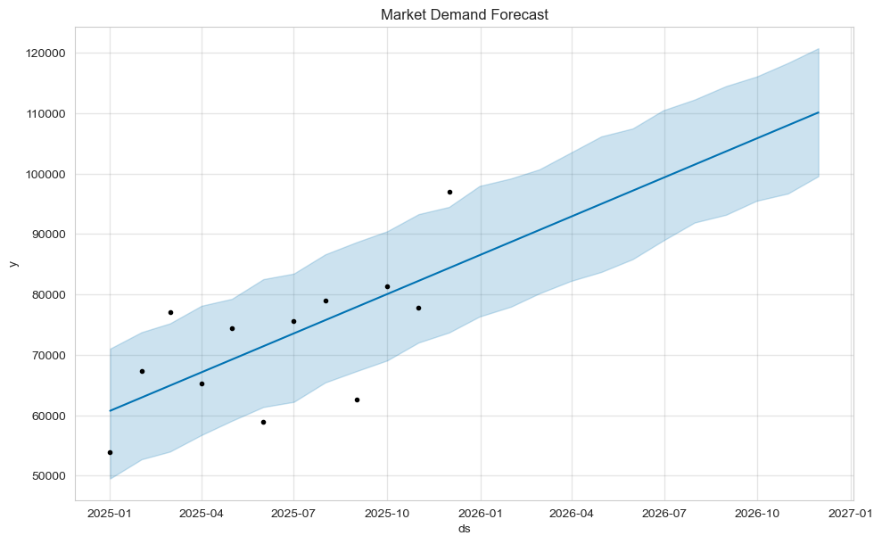

Insights:
- Projected growth trajectory
- Confidence intervals
- Expected market size

Business Impact:
Supports production planning and capacity forecasting.

---

## 4.2 Forecast: Top Makers

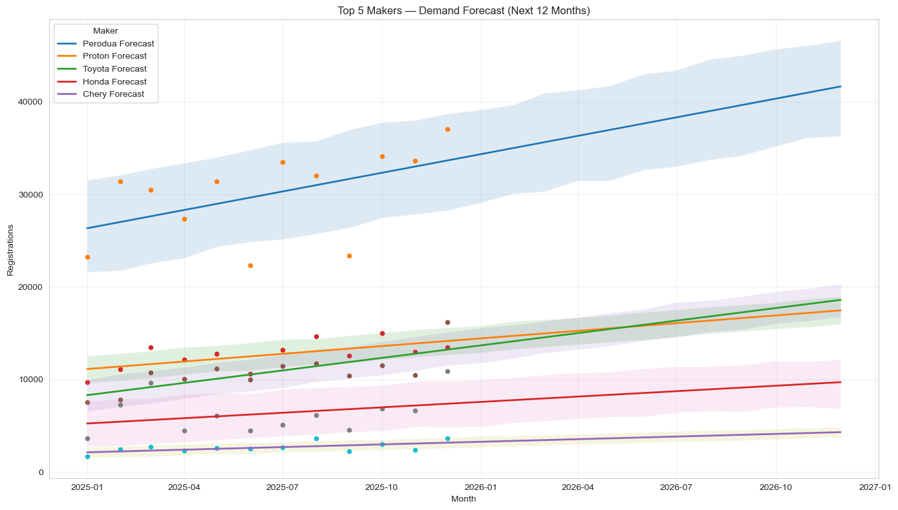

Insights:
- Future brand dominance
- Competitive shifts
- Brand-specific growth expectations

Business Impact:
Strategic supplier and partnership decisions.

---

## 4.3 Forecast: Top Models

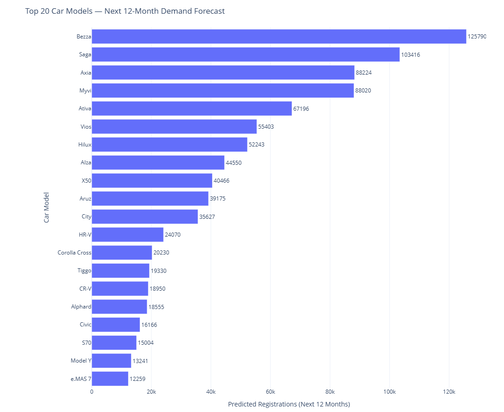

Insights:
- Future best-selling models
- Model demand stability
- High-growth model identification

Business Impact:
Inventory prioritization and pricing strategy.

---

## 4.4 Forecast: Vehicle Type

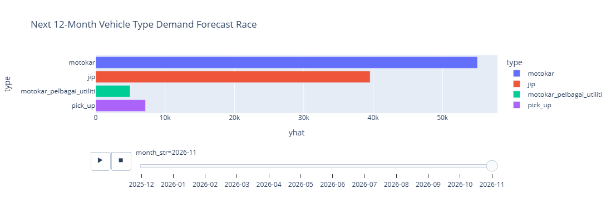

Insights:
- SUV growth sustainability
- Sedan recovery potential
- Emerging segment patterns

Business Impact:
Long-term product mix strategy.

---

## 4.5 Forecast: Colour Preference

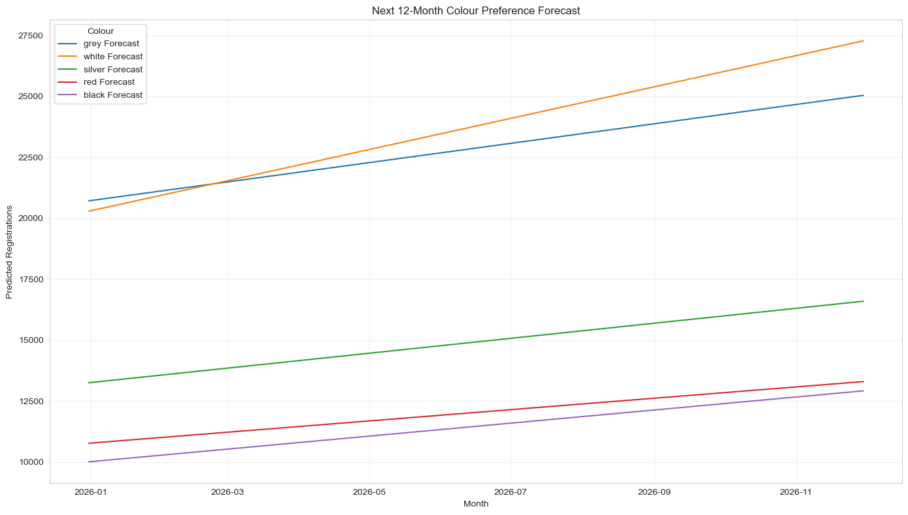

Insights:
- Stability of dominant colours
- Emerging preference signals

Business Impact:
Manufacturing color allocation planning.

---

## 4.6 Forecast: State Demand

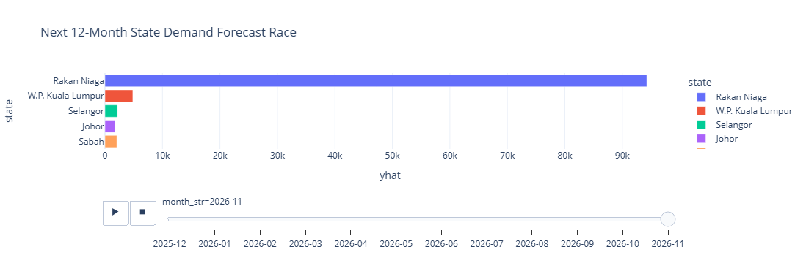

Insights:
- Future regional hotspots
- Growth states vs stagnant states

Business Impact:
Expansion roadmap and dealership placement.

---

# 5. Model Validation & Reliability

To ensure forecast credibility:

- Train-test split backtesting
- MAPE (Mean Absolute Percentage Error)
- Reliability scoring
- Confidence intervals

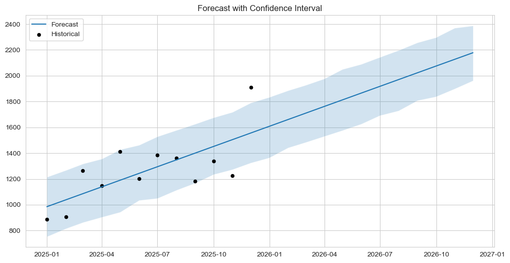

Result:
MAE  : 261.95
RMSE : 324.03
MAPE : 20.64%

Forecast performance is measurable and quantifiable, not speculative.

This enhances decision confidence.

---

# 6. AI-Driven Market Intelligence Engine

Forecast outputs were translated into strategic signals.

Components include:

- Opportunity scoring by state
- Segment growth ranking
- High-demand model identification
- EV readiness assessment

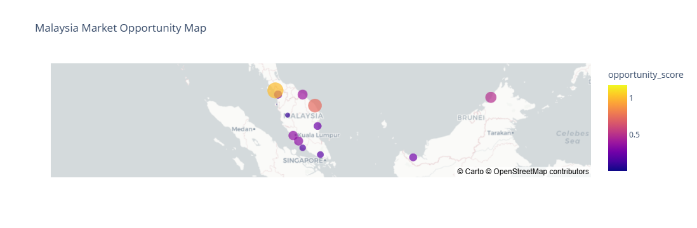

This transforms analysis into **actionable recommendations**.

---

# 7. Strategic Business Recommendations

Based on full analysis:

### 1. Geographic Expansion
Focus expansion in high-growth states identified in forecast.

### 2. Segment Prioritization
Increase SUV allocation if growth trend persists.

### 3. Model Stocking Strategy
Prioritize top forecasted models for inventory efficiency.

### 4. EV Strategic Planning
Gradually increase EV portfolio in states with rising adoption.

### 5. Colour Optimization
Align stock composition with dominant consumer preferences.

---

# 8. Conclusion

This project demonstrates the integration of:

- Data engineering
- Market analytics
- Forecast modeling
- Business strategy translation

It moves from:

Raw Data → Insights → Forecast → Strategy

The framework can be extended into a live dashboard or automated decision-support system.

---

# 9. Tools & Technologies

- Python
- Pandas
- Matplotlib / Seaborn
- Time-Series Forecasting Models
- Statistical Validation Techniques

---

# Author

Syafiq Firdaus  
Data Science | Market Intelligence | AI Forecasting
